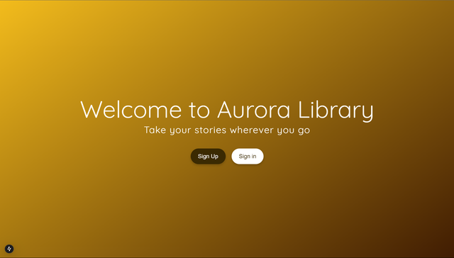
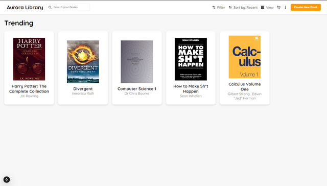
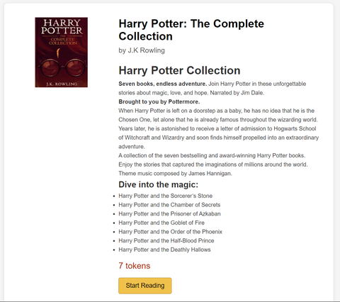

# Project Overview 

Aurora Library is a virtual library platform designed to provide users with easy access to digital content in the form of PDFs. This repository contains the frontend for the Aurora Library, built using modern web technologies for an optimized user experience.

## Technologies Used

- **Next.js**: React framework for server-side rendering and static site generation.
- **TypeScript**: Ensures type safety and improves code quality.
- **React.js**: Core library for building the component-based user interface.

## Features

- **User-Friendly Interface**: Built with React.js for a clean and responsive design.
- **Secure Authentication**: Integrates with backend authentication using bcrypt for secure logins.
- **Type Safety**: TypeScript ensures robust code quality and error prevention.
- **Book Creation**: Users can create and manage their own books within the platform. 


## Getting Started

1. **Clone the repository:**
   ```bash
   git clone <repository-url>
   cd aurora-library-frontend
   ```
2. **Install dependencies:**
   ```bash
   npm install
   ```
3. **Run the development server:**
   ```bash
   npm run dev
   ```
4. **Open in Browser:**
   Navigate to `http://localhost:3000` to explore the platform.

## Available Scripts

- `npm run dev`: Starts the development server.
- `npm run build`: Builds the project for production.
- `npm run start`: Runs the production build.


### Home Page


### Book Listing




## Contributing

Contributions are welcome! Feel free to fork the repo and submit a pull request.


